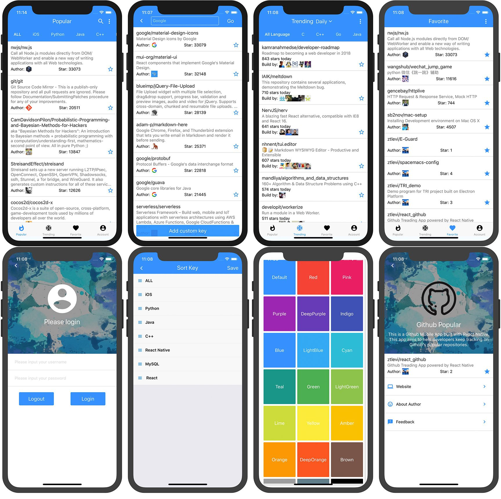

# Hotgit powered by React Native

## Project Scope

Github has an amazing [web page](https://github.com/trending) demenstrating trening repositories. You can filter it by language and daily, weekly or monthly.

But unfortunately, it's not availble on your mobile devices as an application. So this project aims to help developers to track the trending repositories on Github. And it' available on Android and IOS.

## Intsall

install packages with `yarn` and then `yarn ios` or `yarn android` to run the application on the device.

> Notes:
>
> 1. Current react-natiev-modal-popover version has issue with Android. See details here https://github.com/doomsower/react-native-modal-popover/pull/10 .I manually fix this in node_modules by changing `useNativeDriver: Platform.OS === 'ios'`
> 2. If you, or any libraries that you use, use `View.propTypes.style` you will need to change that to `ViewPropTypes.style`. This is required in Expo App 22.

## Detail

For the favorite page, there is some delay for Github API. That's why I put 2 min for fetching remote starred repos. And keep fetching remote starred repos cost a lot of network traffic. Anyway, you are not able to see your new stars instantly.

## Screen shots

## Features

1. [ ] Use custom view for repos instead of WebView
2. [x] Favorite Page add search module
3. [x] Code Coverage
4. [x] Redux and Sage
5. [x] Async and await
6. [x] Eslint
7. [ ] Travis
